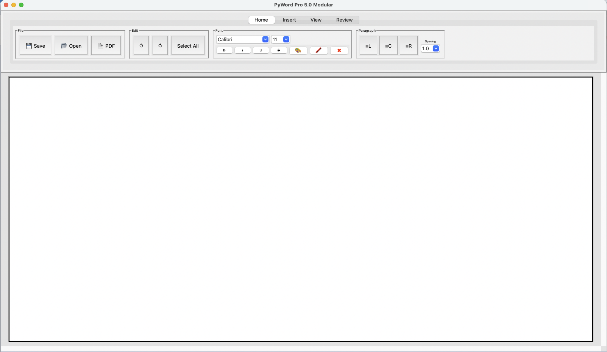

# PyWord Pro

PyWord Pro is a Tkinter desktop word processor built as a local Python application.



## Run From Source

### Requirements

- Python 3.10+
- `pip`

### Install

```bash
python3 -m venv .venv
source .venv/bin/activate
pip install -r requirements.txt
```

### Launch

```bash
python3 main.py
```

## Main Entry Point

[main.py](/Users/robertclemons/Downloads/py_word_pro-main/main.py)

- Creates the Tk root window
- Imports `App` from `src.app`
- Starts the main Tkinter event loop

## Source Layout

[`src/`](/Users/robertclemons/Downloads/py_word_pro-main/src)

[src/app.py](/Users/robertclemons/Downloads/py_word_pro-main/src/app.py)

- Main application controller
- Wires together config, editor UI, file actions, formatting, tools, search, recovery, and commands

[src/config.py](/Users/robertclemons/Downloads/py_word_pro-main/src/config.py)

- App constants
- Theme/config defaults
- Settings load/save logic

[`src/logic/`](/Users/robertclemons/Downloads/py_word_pro-main/src/logic)

- Core non-UI behavior
- File open/save/export
- Formatting helpers
- Templates
- Text processing
- Recovery/autosave
- Tools, action parsing, dictionary lookup, wiki lookup, and security scanning

[`src/ui/`](/Users/robertclemons/Downloads/py_word_pro-main/src/ui)

- Tkinter UI components
- Workspace/editor surface
- Shell layout pieces such as top strip, command bar, navigation, inspector, status strip, and console
- Theme tokens and ttk styling

## Core Dependencies

[requirements.txt](/Users/robertclemons/Downloads/py_word_pro-main/requirements.txt)

- `Pillow`
- `python-docx`
- `pymupdf`
- `pyttsx3`
- `fpdf`
- `pyspellchecker`

## What The App Does

- Opens and saves documents locally
- Supports text formatting and editor tools
- Includes templates and document helpers
- Exports documents to PDF
- Provides local utilities like spell check, read aloud, action extraction, dictionary lookup, and wiki lookup

## Notes

- This repo is intended to run from source with Python
- The main code lives in `main.py` and `src/`
